# Análise dos Resultados dos Testes de Desempenho

Este projeto realiza testes de desempenho na aplicação **Link Extractor**, comparando duas versões do serviço de extração de links: uma implementada em **Python** e outra em **Ruby**.  
Além disso, os testes avaliam o impacto do uso do **cache Redis**, comparando cenários **com cache** e **sem cache**.

A ferramenta utilizada para geração de carga foi o **Locust**, que simulou usuários virtuais acessando a aplicação e coletou métricas como:

- Tempo médio de resposta
- Tempo mediano de resposta
- Percentil 95 do tempo de resposta
- Requisições por segundo
- Quantidade de falhas

Os testes foram executados com diferentes quantidades de usuários virtuais:

- 10 usuários
- 50 usuários
- 100 usuários

Foram avaliados os seguintes cenários:

| Cenário | Versão da API | Cache |
|---|---|---|
| 1 | Python | Com cache |
| 2 | Python | Sem cache |
| 3 | Ruby | Com cache |
| 4 | Ruby | Sem cache |

---

## URLs utilizadas nos testes
Ambos os scripts utilizam as mesmas **10 URLs-alvo**:

| Nº | URL utilizada no teste | Tema |
|---|---|---|
| 1 | `/wiki/Brasil` | Página sobre o Brasil |
| 2 | `/wiki/Fortaleza` | Página sobre Fortaleza |
| 3 | `/wiki/Python_(linguagem_de_programação)` | Página sobre Python |
| 4 | `/wiki/Ruby_(linguagem_de_programação)` | Página sobre Ruby |
| 5 | `/wiki/PHP` | Página sobre PHP |
| 6 | `/wiki/Redis` | Página sobre Redis |
| 7 | `/wiki/Docker_(software)` | Página sobre Docker |
| 8 | `/wiki/Locust_(software)` | Página sobre Locust |
| 9 | `/wiki/Inteligência_artificial` | Página sobre Inteligência Artificial |
| 10 | `/wiki/Portugal` | Página sobre Portugal |

Essas URLs foram escolhidas para representar páginas diferentes da Wikipédia, permitindo que o serviço Link Extractor realizasse a extração de links em conteúdos variados.  

Cada requisição simulava o comportamento de um usuário utilizando a aplicação para extrair os links de uma página web. Dessa forma, foi possível medir o desempenho da aplicação em diferentes cenários de carga, comparando as versões **Python** e **Ruby**, com e sem uso de cache Redis.

---

## Comparativos Gerais

### Tempo médio de resposta

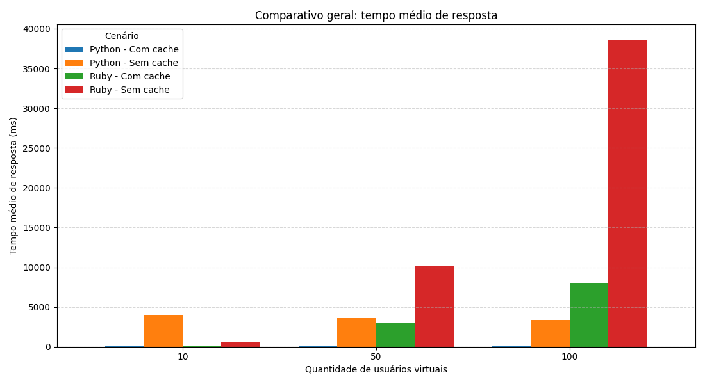

O gráfico apresenta o **tempo médio de resposta** dos quatro cenários testados.

É possível observar que os cenários com cache apresentaram tempos de resposta menores, principalmente quando a quantidade de usuários aumentou.  
O cenário **Ruby sem cache** foi o que apresentou o maior crescimento no tempo médio de resposta, indicando perda de desempenho sob maior carga.

A versão **Python com cache** apresentou o melhor comportamento geral, mantendo tempos de resposta baixos mesmo com o aumento da quantidade de usuários virtuais.

---

### Tempo mediano de resposta

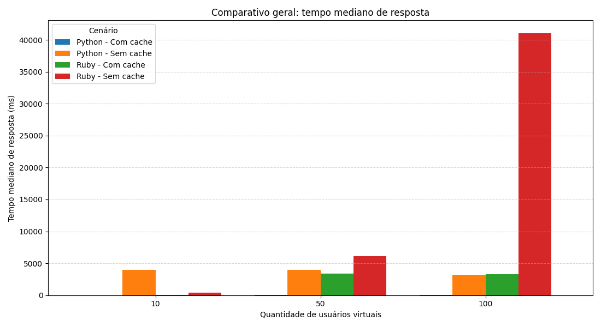

A mediana representa o tempo de resposta mais típico observado durante os testes.

O gráfico mostra que o uso do cache teve impacto positivo, reduzindo significativamente o tempo mediano de resposta.  
Nos cenários sem cache, principalmente em **Ruby sem cache**, o tempo mediano cresceu bastante quando a carga aumentou para 50 e 100 usuários.

Isso indica que, sem cache, a aplicação precisa buscar e processar novamente os links a cada requisição, o que aumenta o tempo de resposta.

---

### Percentil 95 do tempo de resposta

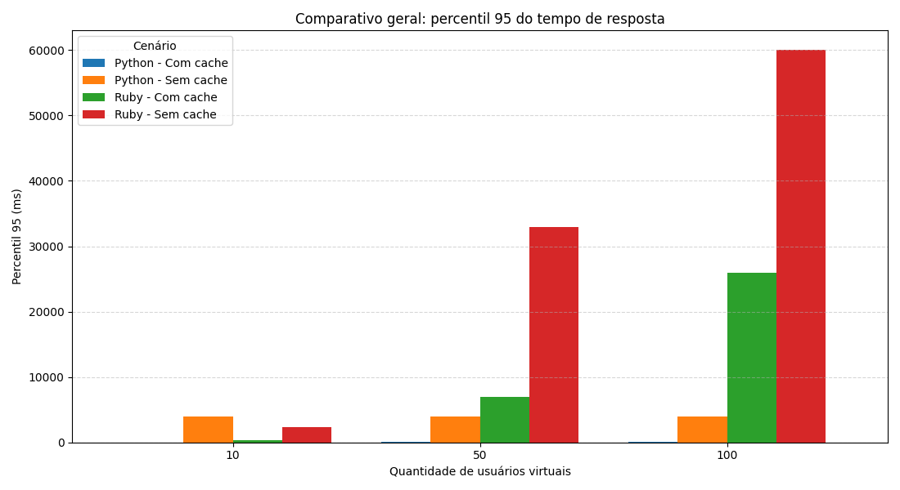

O percentil 95 indica que 95% das requisições tiveram tempo de resposta igual ou inferior ao valor apresentado no gráfico.

Essa métrica é importante porque mostra o comportamento da aplicação em situações próximas ao pior caso, desconsiderando apenas os 5% mais extremos.

O cenário **Ruby sem cache** apresentou os maiores valores de P95, indicando maior instabilidade e maior tempo de espera para parte significativa das requisições.  
Já os cenários com cache tiveram valores menores, demonstrando que o Redis ajudou a reduzir os tempos de resposta mesmo sob maior carga.

---

### Requisições por segundo

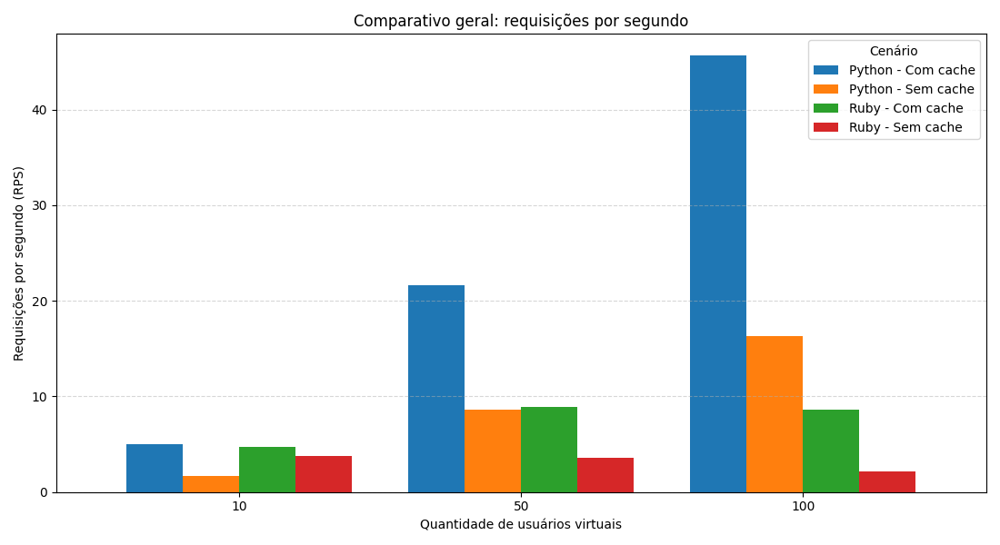

O gráfico de requisições por segundo mostra a capacidade da aplicação de atender múltiplas requisições simultaneamente.

A versão **Python com cache** apresentou o melhor desempenho geral, alcançando o maior número de requisições por segundo conforme a quantidade de usuários aumentou.

O cenário **Ruby sem cache** teve o pior desempenho em RPS, indicando dificuldade em manter alta vazão quando não há utilização do cache.

---

## Comparação entre Python e Ruby com Cache

### Tempo médio de resposta com cache

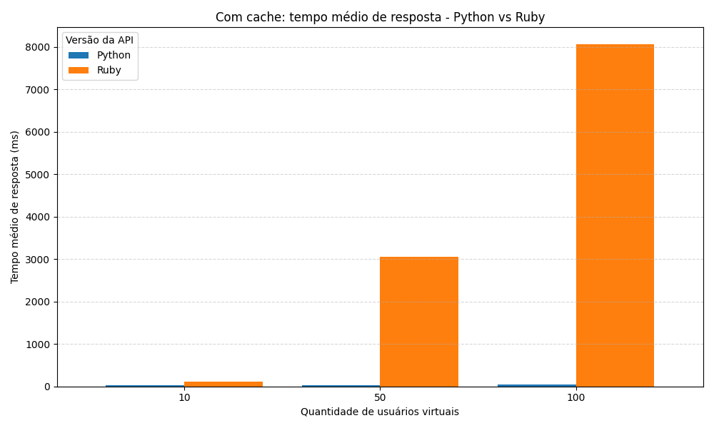

Neste gráfico, são comparadas as versões Python e Ruby utilizando o cache Redis.

A versão **Python com cache** apresentou menor tempo médio de resposta em relação à versão Ruby.  
Isso indica que, quando o cache está ativo, a implementação em Python conseguiu responder de forma mais rápida aos usuários virtuais.

---

### Tempo mediano de resposta com cache

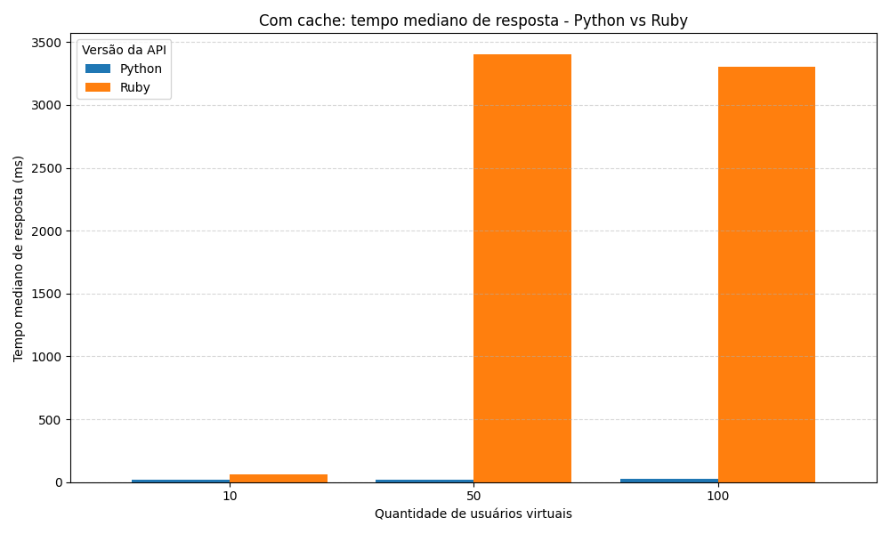

A mediana com cache reforça que o Python teve desempenho mais estável e rápido na maior parte das requisições.

A versão Ruby também foi beneficiada pelo cache, mas ainda apresentou tempos medianos superiores aos da versão Python em parte dos cenários.

---

### Percentil 95 com cache

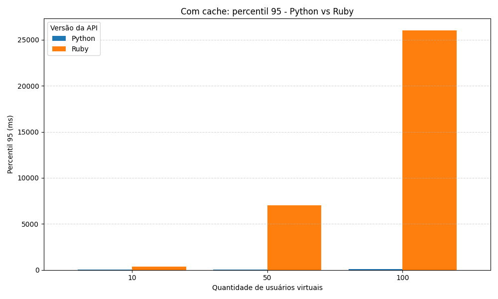

O percentil 95 com cache mostra que o Redis ajudou a reduzir os tempos mais altos de resposta em ambas as versões.

Mesmo assim, o Python com cache apresentou comportamento mais eficiente, mantendo valores menores de P95 quando comparado ao Ruby com cache.

---

### Requisições por segundo com cache

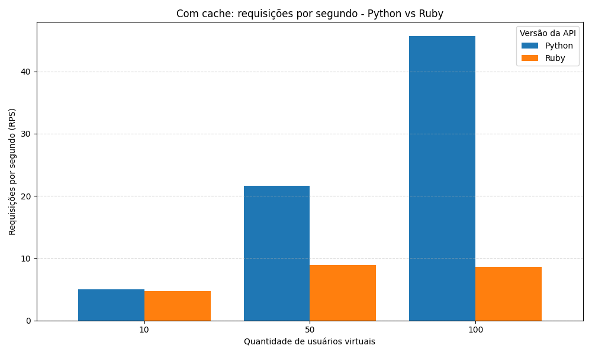

Com o cache ativo, a versão **Python** apresentou maior capacidade de atendimento, alcançando mais requisições por segundo do que a versão Ruby.

Esse resultado mostra que o Python com cache teve melhor aproveitamento da carga gerada pelo Locust.

---

## Comparação entre Python e Ruby sem Cache

### Tempo médio de resposta sem cache

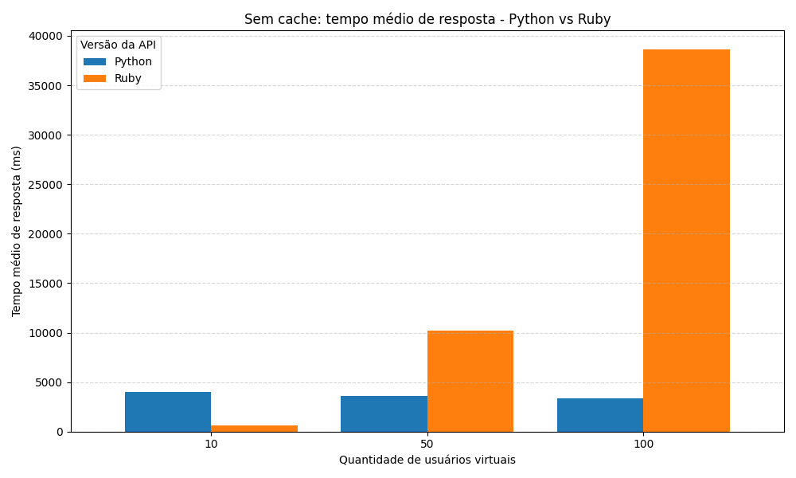

Neste cenário, o cache Redis foi desativado, fazendo com que a aplicação precisasse extrair os links diretamente da URL a cada requisição.

O gráfico mostra que a ausência do cache aumentou significativamente o tempo médio de resposta, principalmente na versão Ruby.

A versão **Ruby sem cache** apresentou o pior desempenho, com crescimento expressivo do tempo médio conforme a quantidade de usuários aumentou.

---

### Tempo mediano de resposta sem cache

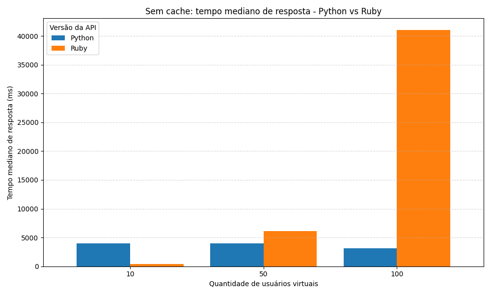

A mediana sem cache mostra que o tempo típico de resposta também foi afetado pela ausência do Redis.

A versão Ruby apresentou aumento mais acentuado no tempo mediano, principalmente nos cenários com 50 e 100 usuários.

Isso demonstra que o cache tem papel importante na redução do custo de processamento das requisições.

---

### Percentil 95 sem cache

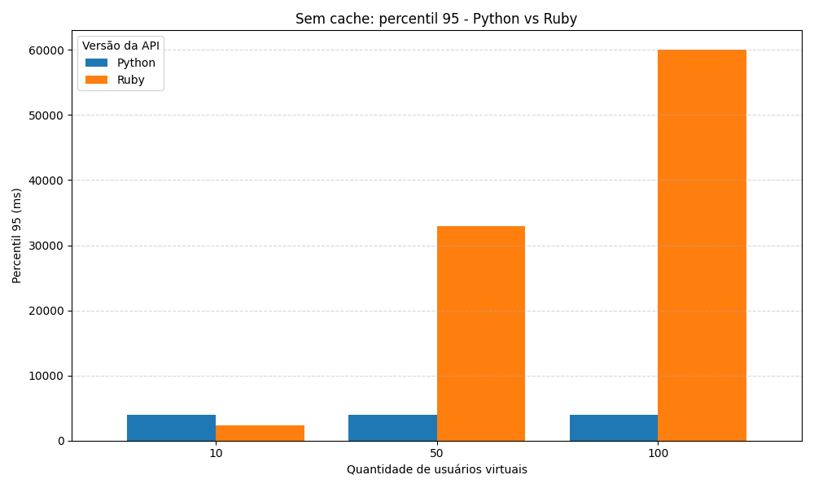

O percentil 95 sem cache apresentou os maiores valores entre todos os cenários testados.

Esse comportamento indica que, sem cache, algumas requisições passaram a demorar muito mais para serem concluídas, principalmente na versão Ruby.

O resultado mostra que a ausência do cache impacta não apenas o tempo médio, mas também a estabilidade da aplicação sob carga.

---

### Requisições por segundo sem cache

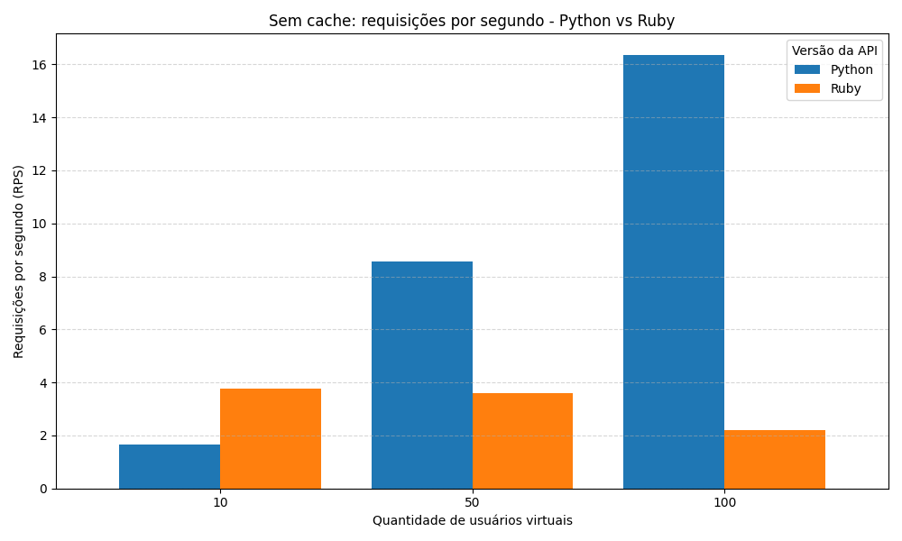

Sem cache, a capacidade de atendimento da aplicação foi reduzida.

A versão Python ainda conseguiu manter uma quantidade maior de requisições por segundo em comparação com a versão Ruby.  
Já o Ruby sem cache apresentou menor RPS, indicando maior dificuldade em lidar com múltiplas requisições simultâneas.

---

## Conclusão

Com base nos testes realizados, foi possível observar que o uso do **cache Redis** teve impacto positivo no desempenho da aplicação Link Extractor.

De forma geral:

- O cache reduziu o tempo médio de resposta.
- O cache reduziu a mediana e o percentil 95.
- O cache aumentou a capacidade de atendimento em requisições por segundo.
- A versão Python apresentou melhor desempenho geral.
- A versão Ruby sem cache apresentou os maiores tempos de resposta.
- A ausência de cache tornou a aplicação mais sensível ao aumento da quantidade de usuários.

Portanto, os resultados indicam que o uso de cache é essencial para melhorar o desempenho da aplicação, principalmente em cenários com maior quantidade de usuários virtuais.

